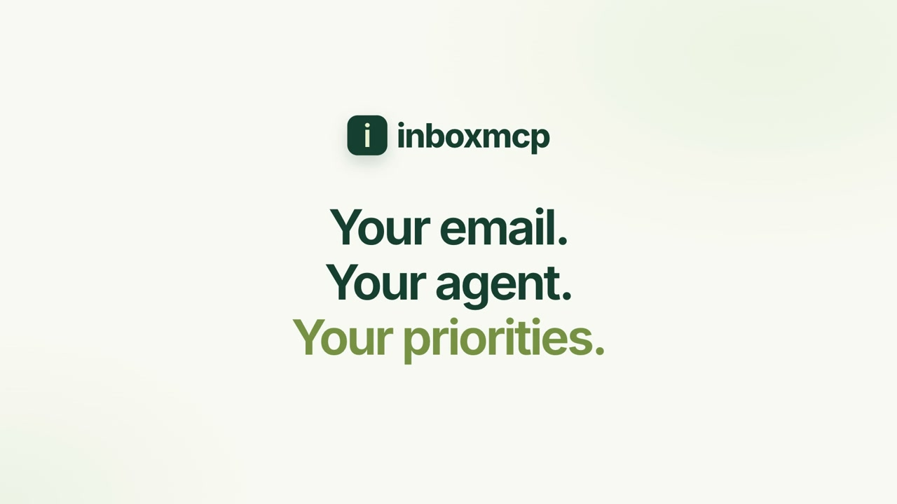

<h1 align="center">inboxmcp</h1>

<b>Your email. Your agent. Your priorities.</b> 
A hosted MCP server that connects the IMAP inboxes you already use to your own AI agent.

<a href="https://inboxmcp.ai">Website</a> ·
<a href="https://app.inboxmcp.ai/app">Dashboard</a> ·
<a href="https://inboxmcp.ai/support">Setup guide</a> ·
<a href="https://claude.ai/directory/inboxmcp">Claude directory</a> ·
<a href="https://x.com/dyland9ym/status/2106770849336590422">90-second demo</a>

This repository holds public documentation and registry metadata for the hosted service. The server source code is not published here.

## What it does

inboxmcp collects new email from your mailboxes and hands each message to the AI agent you choose, together with plain-language instructions you save once. For example: "skip verification codes and card alerts; flag anything a customer is waiting on."

**Your agent decides** what matters and whether to notify you. inboxmcp does not classify, rank or filter your mail.

- **Read-only IMAP.** inboxmcp never sends, deletes or moves messages, and never marks them as read.
- **Many providers.** There are presets for Gmail, iCloud, Yahoo, Zoho, Fastmail, QQ Mail, NetEase 163/126, Alibaba Mail, Tencent Exmail, Feishu/Lark and others. Any public IMAP server on TLS port 993 also works.
- **Scoped access.** You authorize each AI connection for specific mailboxes, using OAuth with PKCE, and can revoke it at any time.
- **Built-in progress.** Each AI connection keeps its own checkpoint inside inboxmcp, so scheduled tasks resume without Notion pages or state files, and messages are not handled twice.
- **Encrypted at rest.** Mailbox credentials, webhook keys, message bodies and saved preferences are encrypted. Message bodies are kept for 30 days by default.

## Connect

| | |
|---|---|
| Remote MCP endpoint (Streamable HTTP) | `https://app.inboxmcp.ai/mcp` |
| Authorization | OAuth with PKCE, discovered from the endpoint |
| Scopes | `email:read`, plus `consumer-state:write` to save this connection's processing progress |

1. Create an account at [app.inboxmcp.ai](https://app.inboxmcp.ai/app), add a mailbox with an app password, and turn on collection.
2. Add the MCP endpoint in an AI client that supports remote MCP. Sign in, choose the mailboxes, and allow both permissions.
3. Optional: in the dashboard, under **Let your AI finish setup**, copy the setup request for your AI and paste it into that AI.

## Platforms

| Agent | How new mail reaches it | Status |
|---|---|---|
| **Grok Bot** | A Grok Routine with a webhook trigger. inboxmcp delivers each new email as it arrives. | Working (beta) |
| **Claude** | Community connector in the Claude directory, plus a Claude Scheduled task that checks for new mail (for example, hourly) | Connector published. Scheduled checks need a Claude plan that includes Scheduled tasks. |
| **ChatGPT** | Remote MCP. MCP Events (`email.received`, `email.pending.v1`) are available for compatible clients. | App submitted for review. Event triggering in ChatGPT has not been verified yet. |
| **Other MCP clients** | Any client that supports remote MCP with OAuth | Reading on demand; set up your own schedule |

Incoming email does not wake every platform automatically. Where a platform has no event trigger, a scheduled task checks inboxmcp at an interval you choose.

## Tools

| Tool | Purpose |
|---|---|
| `get_email_monitor_state` | This connection's progress, collection health and pending count |
| `claim_email_batch` | Lease the next batch of new email, with your saved instructions and a View email link |
| `complete_email_batch` | Confirm only the messages that were actually handled; the rest stay pending |
| `list_mailboxes` | Authorized mailboxes and their status |
| `list_email_events` | Paginated email events |
| `get_email_event` | One event's metadata |
| `read_email` | One message, with its plain-text body and saved instructions |
| `get_email_context` | Event, message and instructions in one call |
| `report_email_decision` | Legacy: records notify/digest/silent and stops remaining Grok delivery for that event |

Email content is treated as untrusted data. The connector passes it to your agent separately from your saved instructions.

## Setup videos

- [Launch demo (1:31)](https://x.com/dyland9ym/status/2106770849336590422)
- [Grok Bot setup (1:42)](https://x.com/dyland9ym/status/2106780269156151420)
- Full written guide, including Claude Scheduled and ChatGPT: [inboxmcp.ai/support](https://inboxmcp.ai/support)
- Machine-readable guide for AI assistants: [agent-setup.md](https://inboxmcp.ai/agent-setup.md) · [llms.txt](https://inboxmcp.ai/llms.txt)

## Plans

Free includes 1 connected mailbox. Plus allows up to 3 mailboxes for US$6/month or US$60/year. Your email provider and AI platform may charge separately.

## Limits

- No POP3, outgoing mail, attachment parsing or full-text search.
- New mail is collected about every 60 seconds. Delivery is not instant, and notifications are sent by your AI platform, not by inboxmcp.
- Mail received before you turn on collection is not imported.

## Links

[Privacy](https://app.inboxmcp.ai/privacy) · [Terms](https://inboxmcp.ai/terms.html) · [Support](https://inboxmcp.ai/support) · Operated by MARTHA TRADE PTE. LTD. · dylan@martha-trade.com
